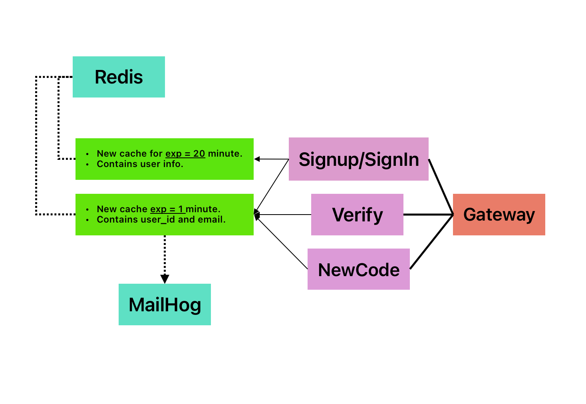

## Email Verification Service
**Email Verification Service,**
*a microservice for handling email verification during user signup/sign-in, using Redis for caching and MailHog for email testing.*
  

## Getting Started
## Requirements
-  ``go``  
-  ``redis`` 
-  ``MailHog``   for local testing
-  ``docker`` 

### Key Components
1. **Redis Caches**:
   - `user_info_cache` (TTL: 20 minutes)
     - Stores full user details post-signup
   - `verification_cache` (TTL: 1 minute)
     - Stores `{user_id, email}` pairs for verification

2. **Services**:
   - **Verify**: Handles code validation
   - **Gateway**: Routes requests
   - **NewCode**: Generates/resends verification codes

3. **MailHog**: Local email catcher for development